#Plataforma OPENSHIFT
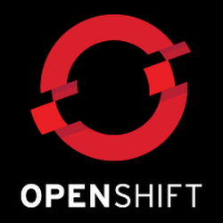
##SERVIDORES WEB DE ALTAS PRESTACIONES
UGR 2014-15

Jesús Prieto López

###Introducción

Al desarrollar aplicaciones web nos surgen varios problemas con la infraestructura típica necesaria: hay que montar un servidor web (p.e. Apache), instalar MySQL, agregar PHP o cualquier otro. Y tener en cuenta también que debemos disponer algún lugar donde servirlo, como nuestro ordenador como servidor, utilizando otro dispositivo, o comprando un hosting, son algunas de las soluciones.

Si estámos en proceso de desarrollo podemos ayudarnos de repositorios como Github, sobre todo si trabajamos en grupo, para organizar y controlar el desarrollo de la aplicación. Pero estas plataformas no sirven como servidores web. A esto me refiero, que por ejemplo, no puedes ver desde la misma plataforma la aplicación web como tal, no puedes hacer uso de su contenido. Sólo almacena el código.

Para estudiar **OpenShift** primero hay que abordar el término *PaaS*. Este servicio surge con el objetivo de ayudarnos con problemas como los comentados en esta introducción.

##PaaS - Plataform As A Service

Plataform As A Service, o plataforma como servicio, es un servicio de computación en la nube que automatiza el almacenamiento, administracion y desarrollo de aplicaciones web, además servir la aplicación y lanzarla para acceder a su contenido.

# OpenShift

Es un proyecto PaaS de código abierto creado por Red Hat con la idea de simplificar y ayudar la programación de aplicaciones web públicas o privadas.

Red Hat proporciona varios de su proyecto PaaS
* **[OpenShift Online](https://www.openshift.com/products/online)**: Este modelo es una PaaS pública alojada en los servidores de Red Hat, sirviendo estos de hosting. Es de acceso gratuito.

* **[OpenShift Enterprise](https://www.openshift.com/products/enterprise)**: PaaS para uso privado.

* **[OpenShift Origin](https://www.openshift.com/products/origin)**: los archivos fuentes para montar tu propia plataforma de PaaS con OpenShift.

###Características

* Código abierto
* Soporte de lenguajes para ajustarse a nuestra aplicación web: PHP, Ruby, JAVA, Node.js, Python y Perl
* Proporciona varias herramientas y módulos: phpmyadmin, consola web, IDE, y otros
* Soporte de frameworks de aplicaciones web
* Entorno de nube flexible
* Infraestructura base en la que apoyarse sin necesidad de instalar nada


### Ventajas

* Fácil de usar
* Fácil de configurar
* Múltiples lenguajes, frameworks y herramientas
* No requiere instalar ningún software, solo es necesario un navegador
* Proporciona hosting
* Portabilidad
* No dependencia de proveedores
* Escalabilidad

Y huelga decir que cuenta con las ventajas que aporta todo repositorio.

## Como funciona

### Ciclo de vida de la aplicación

1. **Code**

  Con el lenguaje y herramientas que desees puedes programar la aplicación. OpenShift trabaja con la herramienta **Git** en todas las aplicaciones que se creen en él.

2. **Build**

  Desde OpenShift se puede ejecutar el código creado para lanzar y servir la aplicación desde la nube que hayamos subido anteriormente.

3. **Deploy**

  Se dispone de la posibilidad de desplegar *cartridges*, que son módulos que se le pueden añadir a la aplicación para añadir funcionalidades, configuración, facilidad de mantenimient u ofrecer servicios.

4. **Manage**

  Desde la web de OpenShift existe la posibilidad de que una vez en funcionamiento nuestra aplicación podemos monitorizarla, configurarla y mejorarla sobre la marcha.

### Componentes

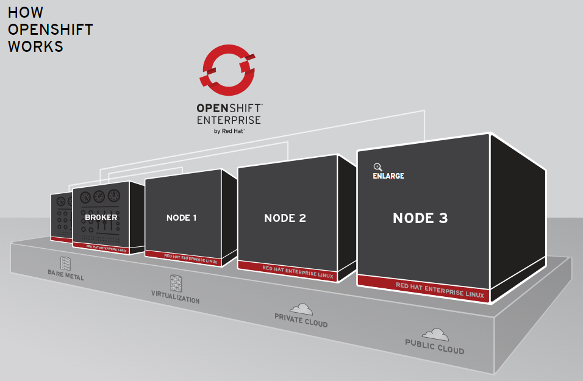
Click [aquí](https://www.openshift.com/walkthrough/how-it-works) para acceder a la vista interactiva

* **Red Hat Enterprise Linux**: es la distribución de Linux en la que está basada OpenShift
* **Infraestructura**: OpenShift puede ejecutarse tanto en servidores, máquinas virtuales o en nube
* **Nodes**: instancias de Red Hat Enterprise Linux donde se almacenan las aplicaciones de los usuarios
* **Broker**: es una herramienta que administra los *Nodes*

Cada *Node* consta de:

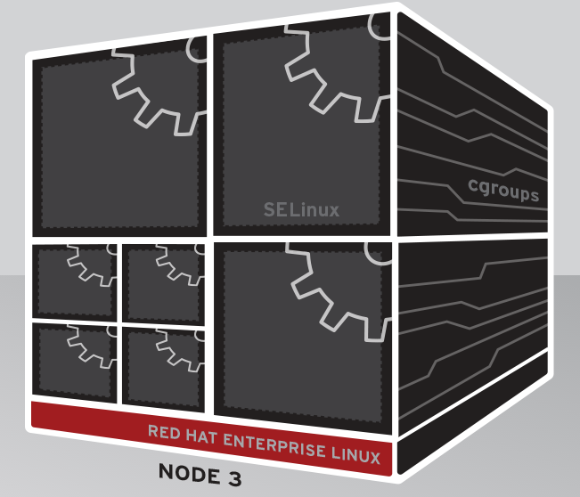

* **Gears**: contenedores donde se ejecutan las aplicaciones
* **SELinux**, Security-Enhanced Linux: módulo cercano al *Gears* que actua como capa de seguridad
* **CGroups**, Control Groups: subsistema que asigna recursos hardware a los *Gears*

### Interior de la aplicación

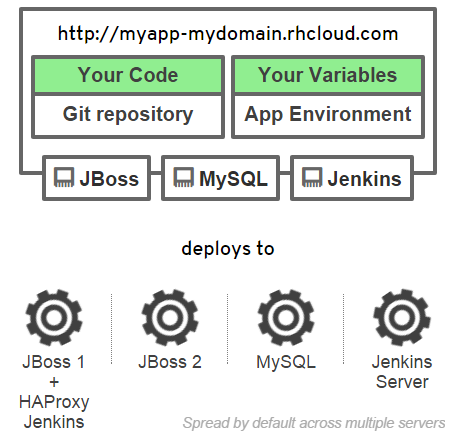

Las aplicaciones, junto a los módulos que añadimos, se almacenan en uno o varios **gears** que funcionan al mismo tiempo y están aislados unos de otros. Los recursos hardware se reparten equitativamente.

Algunos módulos tienen los suyos propios. Y otros tendrán acceso a todos los **gears** disponibles, por ejemplo, los módulos de monitorización.

Cuando creamos la aplicación y subimos nuestro código mediante **Git** al repositorio, el **gears** de **Jenkins Server**, encargado de detectar push de código, compila y envía la aplicación a los **gears** de web que atienden las peticiones HTTP: JBoss + HAProxy. A esto se le añade el **gears** de MySQL para interconectar los módulos entre sí mediante variables de entorno.


## Código abierto

Red Hat pone a disposición el código abierto de **OpenShift** y guías para la contribución a este bajo el nombre **OpenShift Origin**. Colaborando junto a la comunidad para mejorar su servicio y ofrecer nuevas funcionalidades.

El código está almacenado en un repositorio de Github.

https://github.com/openshift/origin

Podemos ver la actividad de su repositorio a fecha de 27/04/2015:
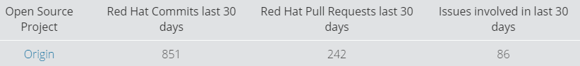


También tienes la posibilidad de descargarlo para desplegar el servicio en un servidor propio y montarlo por tu cuenta:

https://www.openshift.com/products/origin

## OpenShift Online

Dentro del modelo **OpenShift Online** podemos encontrarnos varias versiones, tanto gratuitas como de pago. Según que versión escogamos tendremos mejor o más servicios. Las tres versiones que dan a elegir son las siguientes:


Vamos a probar el **Free Plan** para este ejemplo, ya que ofrece muchos servicios para poder ir viendo de lo que es capaz esta plataforma.

Para registrarnos debemos ir al siguiente enlace: https://openshift.redhat.com/

### Probando OpenShift Online

En este ejemplo vamos a subir una página web hecha en PHP y que trabaja con base de datos MySQL, preparándola para subir el código de una tienda online.

Una vez que nos registramos y accedemos a la plataforma gratuita, lo primero que se nos muestra es la página siguiente:

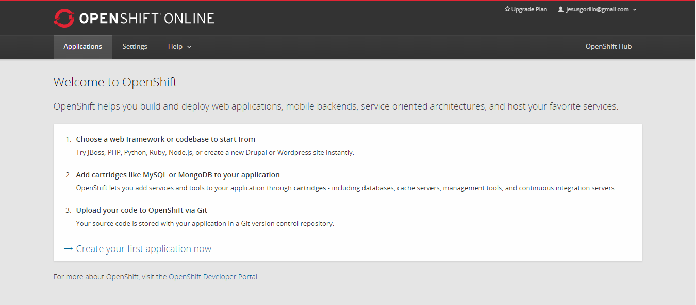

Aquí básicamente te indican que podrás elegir sobre que lenguaje o framework quieres trabajar, que puedes añadir módulos y subir tú codigo.

Si queremos empezar a crear ya una aplicación hay que clickar en **Create your first application now**.

###Creación de la aplicación
Se nos mostrará un listado para elegir el tipo de aplicación que queremos crear. En este caso será una página PHP, por lo tanto buscamos la opción de PHP (elegimos la última versión a poder ser, la 5.4).


En la siguiente página indicamos una parte de la URL pública de nuestra página y las demás opciones. En este caso podemos dejarla por defecto, y de URL le indicamos 'tienda'.

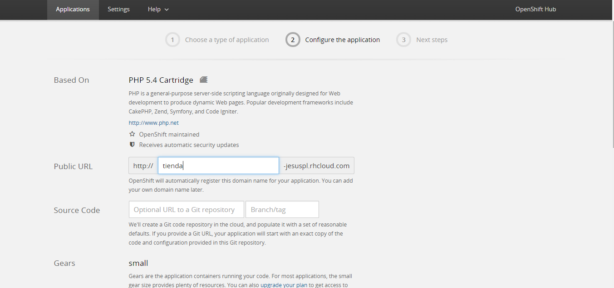

A continuación más abajo indicamos que, por ejemplo, este situado en los servidores de Europa (si da error indicarle el que viene por defecto), y le damos al botón de **Create Application**.

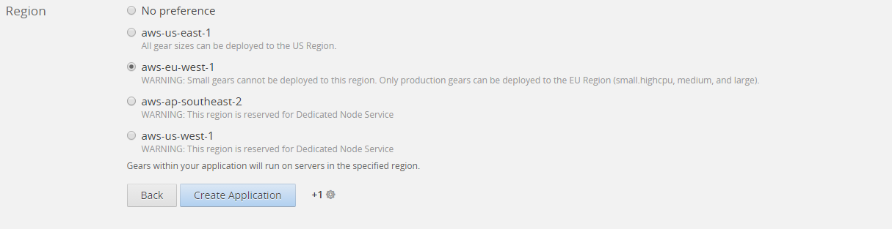

Después de una espera a que se cree la aplicación con la configuración y se complete el proceso se nos mostrará una página con las indicaciones para subir el código o hacer cambios con la herramienta Git.

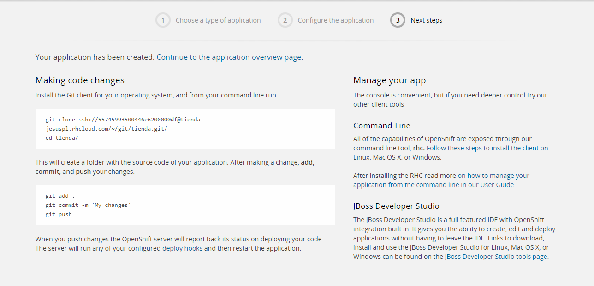

Ya está creada nuestra aplicación. Ahora solo queda subir nuestro código que tengamos creado o vayamos a crear, modificar la aplicación o añadir módulos.

Pulsamos en la opción 'Continue to the application overview page' para ir a la página de control de la aplicación.

Debería mostrarnos algo así:

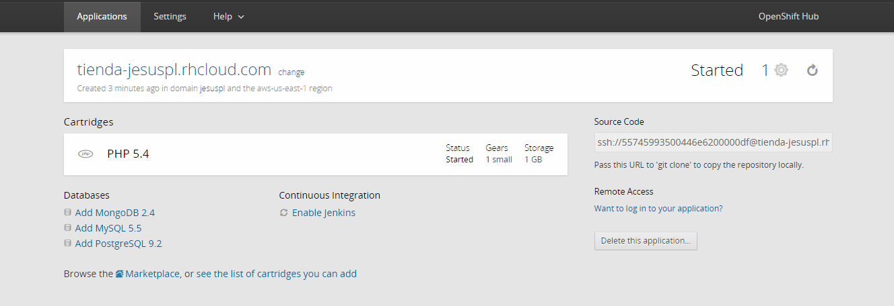

El enlace a nuestra página en este caso será http://tienda-jesuspl.rhcloud.com

###Añadir servicio MySQL y phpMyAdmin

Queremos añadir la base de datos MySQL para trabajar con datos almacenados. Desde el panel de control de la aplicación en la sección 'Databases' pulsamos sobre **Add MySQL 5.5**.

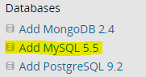

En la página posterior nos mostrará información del módulo o servicio, pulsamos en el botón de **Add Cartridge** para añadirlo.

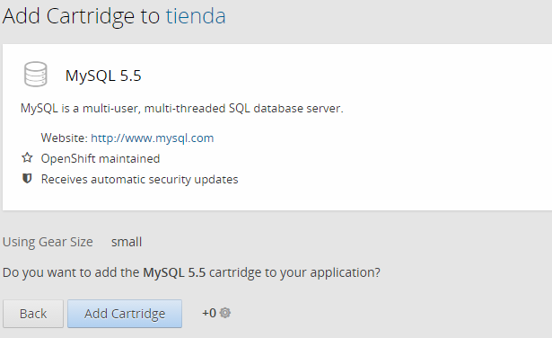

Después de añadirse, el panel de la aplicación debería mostrar la información para conectarse a la base de datos, junto a los módulos disponibles que tenemos en nuestra aplicación.

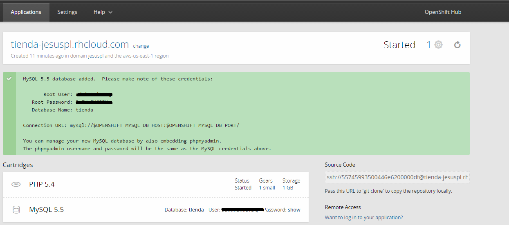

Ya tenemos MySQL instlado. Ahora instalaremos phpMyAdmin para administrar la base de datos de forma cómoda. En la sección 'Tools and Support' seleccionamos **Add phpMyAdmin 4.0** y seguimos los mismos pasos que con MySQL.

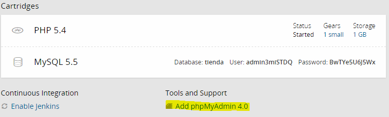

El panel debe quedar así:

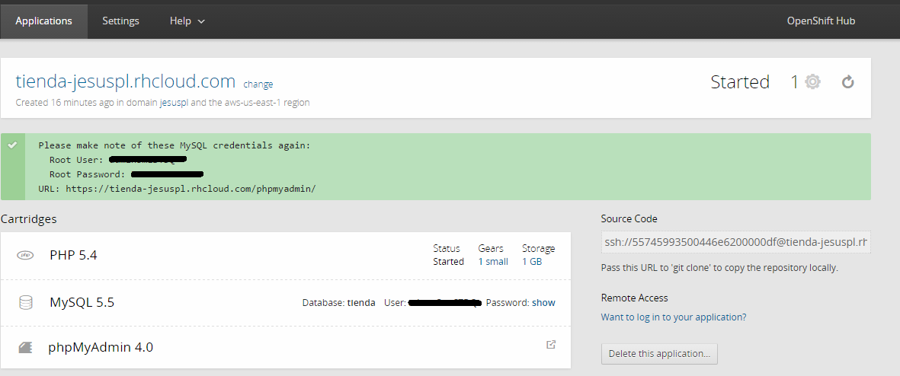

Desde el icono de **phpMyAdmin 4.0** en el panel podemos acceder a phpmyadmin y con nuestra identificación de MySQL administrar la base de datos para prepararla para los datos que tengamos que meter desde la aplicación php que subamos.

### Trabajar con la aplicación

Para empezar a trabajar con la aplicación, creando el código desde 0 o subiendo algo que tengamos ya creado, primero tenemos que realizar un 'git clone' del repositorio en nuestro dispositivo local.

Y antes que esto incluso, necesitamos tener una clave pública para conectarnos al repositorio a través de Git y poder realizar los comandos pertinentes.

Desde la consola de Git introducimos el siguiente comando para crear una clave a la que le indicaremos de nombre 'openshift' y lo demás por defecto:

`ssh-keygen`

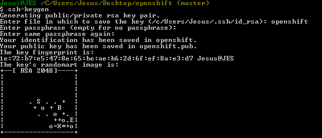

En la página de OpenShift, desde el panel de control de nuestra aplicación accedemos a la pestaña **Setting** y añadimos la clave pública, pegando el contenido del archivo 'openshift.pub' generado antes y pulsando en **Save** para guardarla.

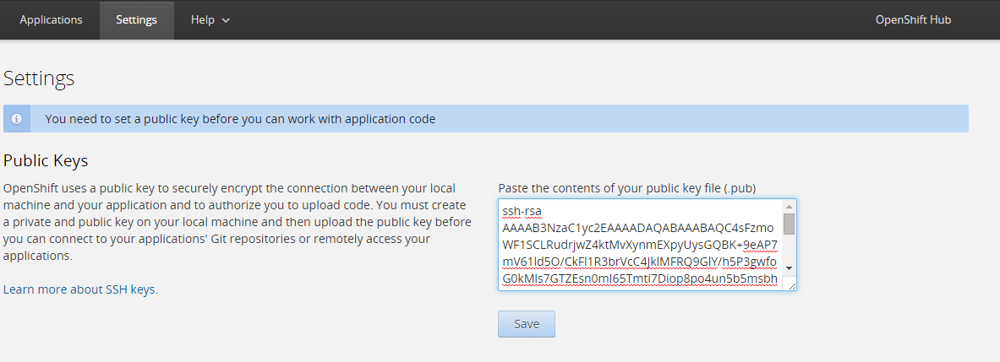

Ahora debemos añadir la clave SSH al agente ssh de nuestro bash. En caso de no tenerlo activo introducimos `ssh-agent -s` o `eval $(ssh-agent -s)` y para añadir la clave:

`ssh-add openshift`

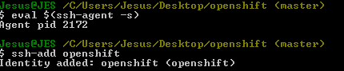

Ahora podemos clonar el repositorio en local.

`git clone <url repositorio> <carpeta destino>`

La url del repositorio viene en el recuadro **Source Code** en el panel de la aplicación.

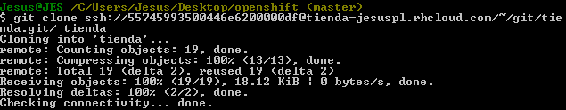

Accedemos a la carpeta que hemos creado y desde ahí podemos ya realizar las operaciones para subir los archivos creados o modificados, con operaciones pertinentes: git add, git commit y git push.

### Conexión con MySQL desde PHP

En este caso, para conectarnos a la base de datos MySQL desde PHP en el ejemplo, se utiliza PDO, indicando el host, el nombre de la base de datos, el usuario administrador y la contraseña.

Para realizar esta conexión con nuestro código en el repositorio de OpenShift Online necesitamos hacer uso de algunas variables:

* Host: getenv('OPENSHIFT_MYSQL_DB_HOST')
* Puerto: getenv('OPENSHIFT_MYSQL_DB_PORT')

Un ejemplo del código necesario para conectarnos a la base de datos sería:

```
<?php
	$dsn = "mysql:host=". getenv('OPENSHIFT_MYSQL_DB_HOST').";port=".getenv('OPENSHIFT_MYSQL_DB_PORT').";dbname=tienda";
	$usuario= "administrador";
	$password= "contraseña";
	try {
		$conexion = new PDO( $dsn, $usuario, $password );
		$conexion->setAttribute( PDO::ATTR_ERRMODE, PDO::ERRMODE_EXCEPTION );
	} catch ( PDOException $e ) { echo $e->getMessage(); }

?>
```

### Subir el código y comprobar el funcionamiento

En este ejemplo voy a usar una tienda online en PHP que he programado para otra asignatura de tecnologías web.

Dentro de la carpeta local del repositorio he copiado el contenido de mi web y he añadido el código al repositorio con lo siguientes comandos:

`git add *`

`git commit -a -m 'Subiendo web online'`

`git push`

Después mediante la URL pública que proporciona OpenShit podemos comprobar que se ha subido y funciona todo correctamente conectandonos a la web.

http://tienda-jesuspl.rhcloud.com/index.php


## Referencias

https://openshift.redhat.com/

http://www.redhat.com/es/technologies/cloud-computing/openshift

http://www.redhat.com/es/about/press-releases/openshift-red-hat-named-infoworld-technology-year-award-winner

http://docs.openshift.org/origin-m4/oo_deployment_guide_comprehensive.html

https://github.com/openshift/origin

https://www.openshift.com/products/architecture
